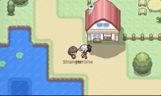
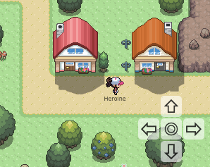

# 

[](https://badge.fury.io/js/oakdex-world-engine) [](https://travis-ci.org/jalyna/oakdex-world-engine) [](https://codeclimate.com/github/jalyna/oakdex-world-engine/maintainability) 



With Mobile Controls:



Based on [oakdex-world-editor](https://github.com/jalyna/oakdex-world-editor).

## Getting Started

```
npm install oakdex-world-engine --save
```

```tsx
import * as React from 'react'
import * as ReactDOM from 'react-dom'

import WorldEngine, { Direction, ActionHandler } from 'oakdex-world-engine'

import * as charset1 from './charset1.png'
import * as charset2 from './charset2.png'
import * as charset3 from './charset3.png'
import * as charset4 from './charset4.png'

const mapData = require('./demo.gamemap.json') // created through http://world-editor.oakdex.org/

let actionHandler: ActionHandler

function timeout (ms: number): Promise<undefined> {
  return new Promise(resolve => setTimeout(resolve, ms))
}

async function onEnterStranger () {
  console.log('TRIGGERED STRANGER')
  if (!actionHandler) {
    return
  }
  actionHandler.disableMovement()
  await actionHandler.changeCharDir('stranger-woman', Direction.Left)
  await timeout(300)
  await actionHandler.changeCharDir('stranger-woman', Direction.Down)
  await timeout(600)
  await actionHandler.changeCharDir('stranger-woman', Direction.Right)
  await timeout(600)
  const up1 = await actionHandler.moveChar('stranger-woman', Direction.Up, { msPerFrame: 100 })
  const up2 = await actionHandler.moveChar('stranger-woman', Direction.Up)
  if (up1) {
    await actionHandler.moveChar('stranger-woman', Direction.Down, { msPerFrame: 150 })
  }
  if (up2) {
    await actionHandler.moveChar('stranger-woman', Direction.Down)
  }
  actionHandler.enableMovement()
  console.log('DONE')
}

ReactDOM.render(
  <WorldEngine
    mapData={mapData}
    viewport={{ width: 19, height: 15 }}
    controllableChar={{ id: 'heroine', name: 'Heroine', image: charset1, x: 36, y: 12 }}
    chars={[
      { id: 'stranger-woman', name: 'Stranger', image: charset2, x: 32, y: 13, dir: Direction.Up }, // bottom is default
      { id: 'guy', image: charset3, x: 44, y: 12, lookNotInDirection: true },
      { id: 'umbrella-woman', image: charset4, x: 40, y: 20, dir: Direction.Left, walkThrough: true }
    ]}
    onLoaded={(mapActionHandler) => { actionHandler = mapActionHandler }}
    onPressEnter={(charId, triggeredChar) => triggeredChar.id === 'stranger-woman' ? onEnterStranger() : console.log('Pressing Enter For', triggeredChar.id)}
    onOver={(charId, triggeredChar) => console.log('Walked over', triggeredChar.id)}
    onWalksTo={(charId, { prev, next }) => console.log(charId, 'walked to', next.x, next.y, next.looksAt.x, next.looksAt.y, next.special)}
    />,
  document.getElementById('app')
)
```


## Contributing

I would be happy if you want to add your contribution to the project. In order to contribute, you just have to fork this repository.

Please respect the [Code of Conduct](//github.com/jalyna/oakdex-world-engine/blob/master/CODE_OF_CONDUCT.md).

```
$ npm install
```

### Build

```
$ npm run build
```

### Running in dev mode

```
$ npm run start
```

Go to `http://localhost:8080/`

### Run tests

```
$ npm test
```

## License

MIT License. See the included MIT-LICENSE file.

## Credits

Logo Icon by [Roundicons Freebies](http://www.flaticon.com/authors/roundicons-freebies).
